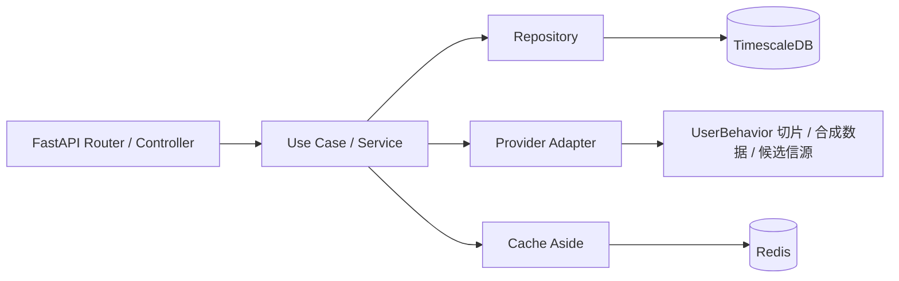

# 后端能力架构与持续优化边界

这份文档定义 Shop Gate 后端能力的长期形态。它不是要求一次性重构完所有文件，而是给后续新增零售数据、评测分析、生成观测和基础组件能力一个稳定落点，避免逻辑继续堆进单个 route 或数据库文件里。

## 结论

后端继续以 Python 为主线。当前性能瓶颈优先来自外部数据源稳定性、IO 并发、缓存命中、批量写入、查询模型和异步任务组织，而不是 Python 语言本身。

Go 或 Rust 暂不作为默认拆分方向。只有当 profiling 明确证明 Python 运行时成为瓶颈时才引入：

| 语言 | 合适场景 | 当前动作 |
| --- | --- | --- |
| Python | FastAPI 接口、数据源接入、入库、指标编排、任务调度 | 继续作为主后端 |
| Rust | CPU 密集指标聚合、超大规则验证内核、列式文件解析、复杂表达式引擎 | 暂不引入，等 profiling 证明 |
| Go | 高并发轻量网关、长连接代理、独立 worker fleet | 暂不引入，等并发瓶颈明确 |

优先优化顺序是：批量接口和批量写入、Redis cache-aside、TimescaleDB 查询模型、读模型聚合表，最后才是后台队列和跨语言拆分。

## 目标形态

commerce 数据服务（`services/commerce-data`）采用轻量 Hexagonal Architecture。外部 HTTP、外部数据源、缓存和数据库都在边界上，核心能力以 Use Case 组织。



请求进入后只走一条清晰链路：

1. Router/Controller 解析 HTTP、参数和响应码。
2. Service/Use Case 编排缓存、数据源、repository、降级和数据质量。
3. Provider Adapter 只负责外部源协议和字段映射。
4. Repository 只负责 TimescaleDB/PostgreSQL 读写。
5. Pydantic Model 作为输入输出契约，供前端、Agent 和测试复用。

## 模块边界

`services/commerce-data/src/shopgate_commerce_data` 的长期结构如下：

| 目录或文件 | 角色 | 责任 |
| --- | --- | --- |
| `api.py` | Compatibility Facade | 保留历史入口，逐步只挂载 router，不承载新业务编排 |
| `routers/` | Controller | FastAPI route、参数校验、HTTP 错误转换、响应模型 |
| `services/` | Use Case | 零售指标、漏斗与渠道聚合、商品/类目查询、导入任务、基础组件和数据分析编排 |
| `providers/` | Provider Adapter | 外部数据源协议与字段映射、候选信源探针（保持候选池隔离） |
| `repositories/` | Repository | TimescaleDB/PostgreSQL 查询、短 TTL 读模型缓存、批量写入、事务和分页 |
| `database_core.py` | Shared Core | 数据库连接、日期规范化、Decimal/JSON 转换、实体（商品/类目/品牌/店铺）元数据解析等无业务状态工具 |
| `cache.py` | Cache Aside | 本地 JSON 缓存和 Redis 短 TTL 缓存 |
| `models.py` | Contract | Pydantic 请求/响应模型和共享枚举 |

当前 `api.py` 仍承担应用装配和少量待迁移路由；旧 `database.py` 兼容门面已经删除。后续新增能力优先落到目标目录，再由 app factory 显式注册 router。

## 基础组件职责

| 组件 | 当前定位 | 为什么需要 |
| --- | --- | --- |
| TimescaleDB | 事实库 | 行为事件、商品/类目日聚合、导入任务书签、数据质量扫描等长期可追溯数据 |
| Redis | 短期缓存 | 热点查询、渠道/指标摘要、任务进度和降延迟 |
| Loki + Alloy + Grafana | 可观测性 | 本地集中日志、生成链路排查、服务状态对照 |
| 文件系统 workspace | 原始产物 | 生成项目源码、证据、大 JSON、截图和验证报告 |
| 服务目录 | 轻量注册表 | Python/Node 服务、基础组件 endpoint、依赖关系和降级边界 |

TimescaleDB 是事实主库。零售指标读取优先走 `commerce.daily_item_metrics` / `commerce.daily_category_metrics` 聚合表和 `/api/v1/commerce/*` 读模型；数据同步状态这类在线读模型优先读取 `commerce.market_data_sync_state`，不要在请求链路里聚合全量 `commerce.user_behavior_events`。

商品/类目筛选的性能边界是“聚合下推”。查询应在数据库内完成单商品最新日去重和窗口聚合（曝光/加购/购买/GMV），只把每个商品一行特征返回 Python；Python 侧负责模式过滤、排序和响应组装。不同 `limit` 请求应复用同一批短 TTL 特征行，避免重复扫描横截面。

## 设计模式

| 模式 | 用在这里 | 约束 |
| --- | --- | --- |
| Hexagonal Architecture | HTTP、provider、cache、storage 都作为边界 | 核心服务不直接依赖 FastAPI Request |
| Controller | `routers/` | 只做协议层，不做复杂数据编排 |
| Use Case / Application Service | `services/` | 一个用户动作或接口能力一个服务函数 |
| Repository | `repositories/` | 数据库 SQL 和事务集中管理 |
| Provider Adapter | `providers/` | 外部源字段变化不扩散到页面和 use case |
| Strategy | provider 选择、筛选器、降级路径 | 实现可替换，可测试 |
| Cache Aside | Redis / local JSON cache | 缓存永远不是事实来源 |
| Service Catalog | `config/service-catalog.json` + ops/API | 不引入 Dubbo3，先用轻量目录管理 Python/Node 组件边界 |
| Outbox / Event Log | 评测事件、生成事件、长任务状态 | 后续接队列或分析层时可重放 |
| Contract Test | guardrail scripts + backend tests | 防止生成模板、数据口径和接口契约回退 |

## 新增能力落点

| 需求 | 优先落点 |
| --- | --- |
| 新数据源 | `providers/` + `provider_candidates.py` + 数据源文档 |
| 新接口 | `routers/` 新 route + `services/` use case + `models.py` contract |
| 新数据表 | `sqls/` + `repositories/` + 数据字典 |
| 新缓存 | service 内 cache-aside，TTL 写入 README 和 infrastructure |
| 新导入任务 | ingestion service + repository + job/event 记录 |
| 新基础组件 | commerce 平台文档、SQL、后端 registry、运维检查 |

## 迁移计划

1. 以当前 HTTP 合同为唯一入口，不再新增旧字段或旧模块兼容层。
2. 新增目录边界和架构检查，先阻止结构继续失控。
3. 把 `api.py` 中的独立域逐步抽成 router：registry、commerce、ingestion、foundation。
4. `database.py` 已删除；新增 SQL 直接进入对应 repository，基础连接与转换只进入 `database_core.py`。
5. 把数据源选择逻辑收敛为 strategy，不让 route 直接感知多个 client。
6. 为 Redis、provider 降级补 contract tests。
7. 当后台任务规模扩大后，引入队列 worker；优先 Python worker，不提前跨语言。

当前已落地：

- 零售读模型已抽到 `routers/commerce.py` 与对应 use case，`/api/v1/commerce/*` 统一承载 meta、resolve、capabilities、漏斗、商品/类目、库存风险、渠道和日汇总查询。
- 数据源注册表已从 `api.py` 抽到 `routers/registry.py` 和 `services/registry.py`，provider 元数据按 Registry Pattern 维护，`api.py` 只传入当前 TTL 配置。
- 基础组件能力已从 `api.py` 抽到 `routers/foundation.py` 和 `services/foundation.py`，覆盖组件状态和数据质量扫描（金融遗留的因子定义与交易日历待零售化）。
- 候选信源能力已从 `api.py` 抽到 `routers/provider_candidates.py` 和 `services/provider_candidates.py`，外部源探针继续保持候选池隔离，不进入主业务链路。
- 缓存写入契约已从 `api.py` 抽到 `services/caching.py`，后续 use case 共享 `read_cached_response` 和 `cache_response`。
- 实体解析（商品/类目）与零售查询不再依赖具体 provider 实现，统一走 `/api/v1/commerce/resolve` 等版本化端点。
- ingestion jobs 控制面已抽到 `routers/ingestion.py` 和 `services/ingestion_jobs.py`，任务列表、暂停、恢复、停止不再留在 `api.py`；任务书签落 `commerce.market_data_ingestion_jobs` / `commerce.market_data_sync_state`。
- `services/*`、`routers/*` 和 `api.py` 直接依赖领域 repository；领域 SQL 已按 repository 模块拆分，旧 `database.py` 已删除，基础连接/转换函数位于 `database_core.py`。

## 提交前检查

涉及后端能力、基础组件或生成质量时，至少运行：

```bash
npm run check:backend-architecture
npm run check:quant-guardrails  # 脚本名为金融遗留命名，仍在护栏中执行
cd services/commerce-data && uv run ruff check . && uv run pytest
```

如果只改前端 UI，也不应该破坏这些后端边界文档和 npm script，因为它们是项目长期可维护性的护栏。
