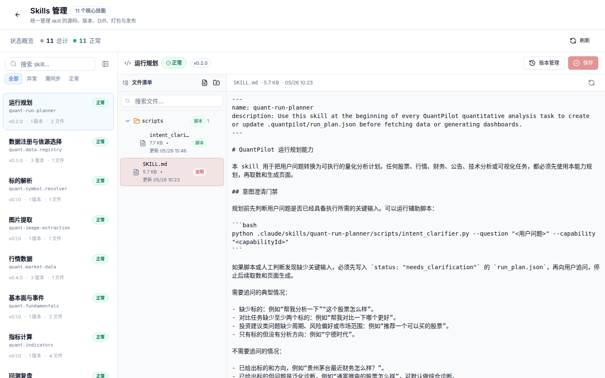

# 04. Skills 与可视化看板

目标：理解 Shop Gate 如何通过 skills 让生成页面更稳定、更好看，并具备自动修复能力。



## Skills 在链路中的位置

Skills 是 Agent 的本地能力包。仓库根目录 `.pi/skills/` 是受 registry/lock、版本与 SHA-256 完整性校验的唯一编译源，目前没有密码学签名；加载顺序是 source 优先、受校验 tgz fallback。项目初始化会把校验后的参考镜像配置到生成工作空间 `.pi/skills/`；Agent 执行阶段仍从仓库输入只读编译本次上下文，不从 workspace 镜像发现能力，也不重新安装镜像。

可以把 skill 理解成“给 Agent 的专业工作手册”。模型本身知道很多通用知识，但它不知道 Shop Gate 当前有哪些数据源、页面契约、验证规则和审美要求。Skill 把这些项目内规则写下来，让每次生成更稳定。

一个好 skill 通常解决三类问题：

- 让 Agent 知道该做什么：例如先写 run plan，再取真实数据，再生成页面。
- 让 Agent 知道不能做什么：例如不能 mock 数据、不能把所有页面套成同一个模板。
- 让 Agent 知道失败后怎么修：例如 build 失败看报错，视觉失败看截图和布局约束。

常见能力：

| Skill | 用途 |
| --- | --- |
| `run-planner` | 把自然语言问题拆成 run plan |
| `commerce-data-registry` | 选择数据源和字段口径 |
| `commerce-market-data` | 行为事件、经营趋势和导入书签规则 |
| `commerce-master-data` | 商品、类目、品牌、店铺主数据与合成口径 |
| `commerce-metrics` | 转化率、GMV、库销比、客单价等经营指标 |
| `dashboard-visualization` | 生成可视化看板和自动修复布局 |
| `data-quality` | 检查缺失字段、来源和数据质量 |

> 注：`commerce-*` 领域 skill 由 `quant-*` 改名而来，内部仍保留部分金融计算逻辑，功能级零售化进行中；学习时以它们应当承担的零售职责为准，细节见[零售域事实基线](../review/retail-facts-baseline.md)。

## 管理和发布

| 文件 | 用途 |
| --- | --- |
| `.pi/skills.registry.json` | 仓库 Skills 注册表 |
| `.pi/skills.lock.json` | 当前锁定版本 |
| `.pi/skills.changelog.json` | 版本变更记录 |
| `.pi/skill-packages/*.tgz` | 受 lock 与 SHA-256 完整性校验的打包产物 |
| `<workspace>/.pi/skills/` | 项目初始化生成的参考镜像；当前 Agent 执行不从这里加载 |

常用命令：

```bash
npm run check:skills
npm run check:skills:metadata
npm run package:skills
```

## 可视化不应只有一套模板

生成看板应根据数据形态自动匹配模板：

| 数据形态 | 推荐模板 |
| --- | --- |
| 商品与类目结构问题（价格带、库销比） | catalog-structure 多面板模板 |
| 流量与转化问题（曝光→收藏→加购→购买） | funnel-analysis 多面板模板 |
| 类目或商品排名 | 排行榜 + 分布图 |
| 价格与库存规则验证 | price-inventory 模板：价格带分布、库销比、库存风险 |
| 每日经营回顾 | daily-brief 模板：平台概览、类目经营榜、观察池 |
| 数据质量检查 | 覆盖率、缺失字段、异常样本和补数建议 |

重点是让生成页面读懂数据结构，而不是把所有任务塞进单商品模板。

## 经营看板的基础审美

零售经营分析页面不是营销落地页。它的第一目标是让运营者快速比较、定位异常和复盘经营动作，所以要偏信息密度、清晰层级和可扫描性。

| 设计问题 | 推荐处理 |
| --- | --- |
| 主图太小 | 漏斗、趋势、分布等核心图应占据主要宽度 |
| 指标带太长或末行孤项 | 先裁剪弱指标，再按数量均衡分栏；7 项可用宽屏单行或中屏 `4 + 3`，禁止固定六列形成 `6 + 1` 空洞布局 |
| 表格太宽 | 优先服务端分页、列裁剪、按需展开 |
| 颜色太乱 | 指标好坏、风险、状态使用稳定语义色，不为装饰乱用颜色 |
| 只有图没有解释 | 关键结论旁边要有数据窗口、样本口径和限制；渠道证据留在后台 evidence |

经营页面常见的“漂亮但没用”包括：大面积空白 hero、装饰性渐变、无交互的小趋势图、字段重复的卡片网格、用 `-` 填满缺失数据。Shop Gate 默认采用连续分析工作台：同一分析画布上通过分区线、指标带、主图、矩阵和表格建立层级，不把每组数据包装成悬浮白色圆角盒。

## 自动修复能力

生成页面失败时，平台会把验证报告、视觉报告和 repair plan 交给 Agent。`dashboard-visualization` 应优先修复：

- `npm run build` 失败。
- 最终数据文件存在但结构没有被页面正确消费。
- 图表过小、只有迷你趋势图、缺少主图。
- 多类目数据被单商品模板错误展示。
- 桌面端或移动端横向溢出。
- 数据区、表格、图例、标签互相遮挡。
- 指标带末行只有一个窄指标、数字被拆行或容器出现大片空白。
- 页面使用 mock 数据或丢弃真实数据字段。

运行中的 Agent 自修复只修改当前生成项目目录内的文件，不能回头改平台源码或伪造数据。若同一视觉失败在多个工作空间重复出现，平台维护者应把规则沉淀到基础模板、`dashboard-visualization` skill 和视觉验收器，而不是逐个项目打补丁。

## Skill 该如何迭代

更新 skill 时，优先把失败案例转成明确规则，而不是泛泛写“页面要好看”。例如：

| 失败案例 | 应沉淀成的规则 |
| --- | --- |
| 漏斗图坐标轴文字和柱子重叠 | 图表底部留足轴标签空间，移动端减少刻度 |
| 多类目页面变成单商品模板 | 根据实体数量（如类目数）选择多类目对比布局 |
| 数据文件里有库销比但页面没展示 | 重要字段必须进入 summary 或 hover detail |
| 缺数据时页面显示 0 | 缺失值展示“缺失/不可计算”，并引用 data_quality |
| 视觉修复改了平台源码 | 修复范围限制在当前工作空间 |
| 7 个指标被固定 6 列排成 `6 + 1` | 生成器按数量使用语义列布局；中屏均衡为 `4 + 3`，视觉验收阻断孤立末行 |

每次改 skill 后至少跑 `npm run check:skills`，涉及生成页面质量时还应跑对应评测或视觉 smoke。

## 视觉验收建议

- 桌面端先保证信息密度和扫描效率，再做装饰。
- 经营看板的主图要够宽、坐标轴和日期不能贴到图形上。
- 多类目对比应优先展示矩阵、排行或分组，而不是一屏堆很多小图。
- 重要指标要跟随 hover 日期动态变化。
- 缺失数据要说明原因，不用 `-` 假装可计算。
- 移动端优先保证数据区宽度、图表高度和表格可读性。

截图验收时如果出现 Next 错误页、验证失败页、空白页或明显布局错位，需要先修复再归档截图。
